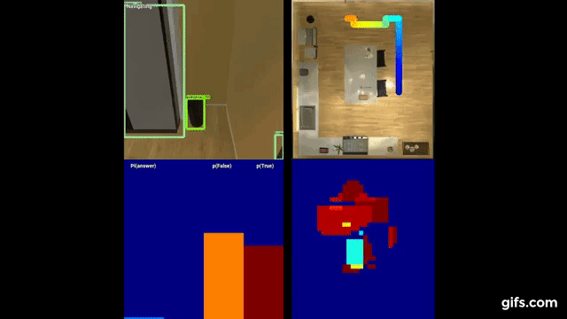

# THOR-IQA-CVPR-2018


This repository contains the code for training and evaluating the various models
presented in the paper [IQA: Visual Question Answering in Interactive Environments](https://arxiv.org/pdf/1712.03316.pdf).
It also provides an interface for reading the questions and generating new questions if desired.

## If all you want is IQUAD-V1:
IQUAD, the Interactive Question Answering Dataset, is included in this repository.
If you do not want the rest of the code, then you may find what is included in the [questions](questions) folder sufficient as long as you also have a working version of THOR.
You should be able to set up THOR using the simple pip install command, but you may want to install the exact version specified in the [requirements.txt](requirements.txt).

[questions](questions) contains three sub-folders:
- [train](questions/train): Training questions in the first 25 rooms
- [unseen_scenes](questions/val/unseen_scenes): Test questeions in the remaining 5 rooms
- [seen_scenes](questions/val/seen_scenes): Test questions in the first 25 rooms

Each of those sub-folders contain three more subfolders for the different question types:
- [data_existence](questions/train/data_existence): "Is there a mug in the room?"
- [data_counting](questions/train/data_counting): "How many mugs are in the room?"
- [data_contains](questions/train/data_contains): "Is there a mug in the fridge?"

Finally, each of those folders contains csv files listing the  templatized natural-language questions and answers, as well as automatically extracted object information such as the important object ids.
It also contains the seeds and scene numbers which are crucial for setting up the THOR environment to contain a scene where the answer is correct.
For convenience I also provide an hdf5 file containing the same information as the csv file except for the natural language sentences.

## Requirements:
1. Python 3.5+.
2. Python VirtualEnv (see First Time Setup).
3. [CUDA](https://developer.nvidia.com/cuda-downloads).
4. [cuDNN](https://developer.nvidia.com/cudnn).
5. [Darknet](https://pjreddie.com/darknet/install/). You will need to clone the yolov3 branch. https://github.com/pjreddie/darknet/tree/yolov3' and make sure the python folder is in your pythonpath.

## Compatibility
This code is known to work in any of the following configurations
1. Python 3.5, 3.6, possibly Python 2.7 but may require a few function name changes.
2. CUDA 8, CUDA 9.
3. Ubuntu 14.04, Ubuntu 16.04, Possibly Mac OSX.
4. TensorFlow 1.2 - 1.5. Special Note: Tensorflow installed via pip only works as follows CUDA 8 = tensorflow-gpu<1.5. CUDA 9 = tensorflow-gpu>=1.5. Requirements auto-installs 1.5, but you can easily change that to 1.4 to be compatible with CUDA 8.

It is likely to work in other setups as well, but I have not personally checked. If you do find issues, please be sure to tell me and I will see what I can do.
That being said, I reserve the right to ignore these requests, especially if they involve Windows.

## First Time Setup:
```bash
cd thor-iqa-cvpr-2018
sudo apt-get install python-virtualenv # or whatever package manager you use
virtualenv -p $(which python3) thor_iqa_env
source thor_iqa_env/bin/activate
pip install --upgrade pip
pip install -r requirements.txt
sh download_weights.sh # downloads the pretrained weights for the depth estimation network, yolov3 trained on THOR, and various networks described in the paper.
```
### Enter the virtualenv in a later session to use the installed libraries.
```bash
source thor_iqa_env/bin/activate
```
### To exit the virtualenv
```bash
deactivate
```

## Making sure THOR is working properly
I have provided a very small test suite to make sure AI2THOR is running properly on your computer. To check if this is the case, run
```bash
python run_thor_tests.py
```
### Common Issues: The Unity environment never starts up.
Check that you have an X Server running. If you are using a graphical interface, then you should be fine.
If you are (for example) training on a remote server, you may have to start an X Server yourself.
I have provided a useful script for doing this. Simply run
```bash
invoke startx <gpu-to-start-on> <display-to-set> &
```
This will start the X Server running in a background process. If for whatever reason display 0 is already in use,
you can set the display to some other number, but you will also need to change it in [constants.py](constants.py).
For example if you run
```bash
invoke startx 2 3 &
```
The Unity processes, when they are run, will load onto GPU 2, and the display should be 3.0.
If this still does not work, you may have an incompatible setup, and you may wish to try the docker version of AI2THOR.


## Training
Training a specific network or controller/agent without any extra modifications is fairly straightforward.
First, modify the TASK variable in [constants.py](constants.py) to match the desired task. Then run:
```bash
python train.py
```
More specific details on each TASK are provided below.
- **navigation**: Train the navigation agent. I found that as few as 5000 iterations was enough to train a robust agent.
- **language model**: Train the very simple language model from sentences to question information. Don't be surprised if it gets 100% accuracy on the test set, as the same question wording will likely be in the training set and the test set.
- **question_map_dump**: Run this to generate the pretraining data. The generated file should be about 10 GB.
- **semantic_map_pretraining**: Run semantic_map_pretraining to train on the generated data. When it has converged, kill it and delete the question_map_dump file if you want.
- **rl**: Trains the full RL question answering model. Various ablation parameters can also be found in [constants.py](constants.py).
- **end_to_end_baseline**: Train the end_to_end A3C style baseline. This should perform at nearly random chance according to our experiments.

## Evaluation
Evaluating is very similar to training. First, modify the TASK variable in [constants.py](constants.py)
to match the desired task as well as any other network architectures. 
Then run:
```bash
python eval.py
```
The results will be saved in the same path as the Tensorboard logs in a timestamped csv file.
Evaluation is currently only supported for **rl** and **end_to_end_baseline**.

If you want to evalate on questions in unseen rooms, then set TEST_SET to 'unseen_scenes' in [constants.py](constants.py).
If instead you want to evaluate on questions from the training rooms, set TEST_SET to 'seen_scenes'.

## Visualizations
During training, it may be useful to view certain bits of output. 
Currently, the code is set up to dump various state images such as the currently provided Unity image,
the semantic spatial map, and the answer probabilities in visualizations/images once per frame. 
If you do not want visualizations, set DRAWING to False in [constants.py](constants.py).

## Generate Questions:
I have provided the code that generated the IQUAD V1 dataset. 
It may be useful for you to know how the data was generated or if you want to make a new dataset. 
If you generate new questions, they will not match the provided dataset due to threading and no initial seeding, but the distributions should be the same.
Each question is generated as part of a group of questions that spans all possible answers for that question type.
Each question is additionally checked for feasibility in terms of object visibility from a valid ground point.

You can generate new questions by running:
```bash
python generate_questions.py  # This will take a few hours
```

## Other Repos Used
Thanks to these repositories, I didn't have to do lots of hard work. The below projects were used by our code. If you use our code, make sure you can use theirs too, and please cite them as well.

- https://github.com/miyosuda/async_deep_reinforce for A3C skeleton code
- https://github.com/pjreddie/darknet/tree/yolov3 for object detection via YOLO V3
- https://github.com/iro-cp/FCRN-DepthPrediction for Depth Estimation

## License and Citation

THOR-IQA-CVPR-2018 is released under the Apache 2.0 License.

Please cite THOR-IQA-CVPR-2018 in your publications if it helps your research:
```
@inproceedings{gordon2018iqa,
  title={IQA: Visual Question Answering in Interactive Environments},
  author={Gordon, Daniel and Kembhavi, Aniruddha and Rastegari, Mohammad and Redmon, Joseph and Fox, Dieter and Farhadi, Ali},
  booktitle={Computer Vision and Pattern Recognition (CVPR), 2018 IEEE Conference on},
  year={2018},
  organization={IEEE}
}
```
